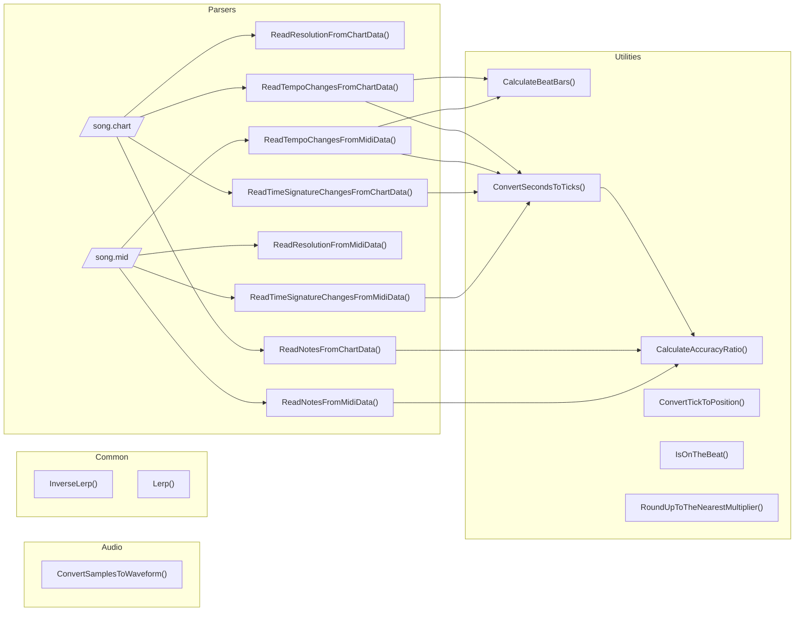

> [!注意]
> 该项目处于早期开发阶段，暂不应用于生产环境。


[](https://github.com/rhythm-game-utilities/rhythm-game-utilities/actions/workflows/test.workflow.yml)
[](https://github.com/rhythm-game-utilities/rhythm-game-utilities/actions/workflows/build.workflow.yml)
[](https://www.nuget.org/packages/com.neogeek.rhythm-game-utilities/)
[](https://discord.gg/nNtFsfd)

[English][readme-en-link] | **简体中文**

本项目是一组用于制作如《Tap Tap Revenge》、《Guitar Hero》和《Rock Band》这样的节奏游戏的实用工具。它旨在用于任何支持加载C++库的游戏引擎，如Unity、Unreal、Godot、SDL和MonoGame。


_用这些实用工具制作的原型游戏_

## 特性

- 🎵 解析 `.chart` 和 `.midi` 音频文件
- 🎼 计算位置以便于渲染音符
- 💯 计算命中精准度
- 🥁 确定当前时间是否踩在节拍上
- 💫  还有更多!

## 社群

- Star [本仓库](https://github.com/rhythm-game-utilities/rhythm-game-utilities) 以便获取更新
- 在 [Bluesky](https://bsky.app/profile/scottdoxey.com) 上关注我
- 加入 [Discord](https://discord.gg/nNtFsfd)
- 在 [GitHub](https://github.com/neogeek/) 关注我

## 目录

- [适用引擎](#platforms)
- [安装](#install)
- [API](#api)
  1. [音频](#audio)
     1. [ConvertSamplesToWaveform](#audioconvertsamplestowaveform)
  1. [通用](#common)
     1. [InverseLerpUnclamped](#commoninverselerpunclamped)
     1. [InverseLerp](#commoninverselerp)
     1. [Lerp](#commonlerp)
  1. [解析器](#parsers)
     1. [ReadNotesFromChartData](#chartreadnotesfromchartdata)
     1. [ReadResolutionFromChartData](#chartreadresolutionfromchartdata)
     1. [ReadTempoChangesFromChartData](#chartreadtempochangesfromchartdata)
     1. [ReadTimeSignatureChangesFromChartData](#chartreadtimesignaturechangesfromchartdata)
     1. [ReadNotesFromMidiData](#midireadnotesfrommididata)
     1. [ReadResolutionFromMidiData](#midireadresolutionfrommididata)
     1. [ReadTempoChangesFromMidiData](#midireadtempochangesfrommididata)
     1. [ReadTimeSignatureChangesFromMidiData](#midireadtimesignaturechangesfrommididata)
  1. [计算工具](#utilities)
     1. [CalculateAccuracy](#utilitiescalculateaccuracy)
     1. [CalculateAccuracyRatio](#utilitiescalculateaccuracyratio)
     1. [CalculateTiming](#utilitiescalculatetiming)
     1. [CalculateBeatBars](#utilitiescalculatebeatbars)
     1. [ConvertSecondsToTicks](#utilitiesconvertsecondstoticks)
     1. [ConvertTickToPosition](#utilitiesconvertticktoposition)
     1. [FindNotesNearGivenTick](#utilitiesfindnotesneargiventick)
     1. [IsOnTheBeat](#utilitiesisonthebeat)
     1. [RoundUpToTheNearestMultiplier](#utilitiesrounduptothenearestmultiplier)

- [项目结构](#architecture)
- [Git Hooks](#git-hooks)
- [关于测试](#testing)
- [编译](#build)
- [做出贡献](#contributing)
- [社区链接](#community-roadmap)
- [其他项目](#other-projects)
- [许可](#license)

## 适用引擎

该库旨在通过单一代码库支持多个引擎。这是一个非常雄心勃勃的目标，因此如果您在开发过程中遇到所选平台的问题，请留下详细的错误报告，并尽可能多地提供信息。此外，由于该库相对较新，移动平台将在所有其他平台完成后才得到全面支持。


| 引擎                                  | 编程语言 | 操作系统 |                  版本                  | 是否测试 | 是否稳定 |
| --------------------------------------- | -------- | -------- | :---------------------------------------: | :----: | :----: |
| [Unity](https://unity.com/)             | C#       | macOS    | 6000.0.22f1<br>2022.3.50f1<br>2021.3.44f1 |   ✅   |   ❌   |
| [Unity](https://unity.com/)             | C#       | Windows  | 6000.0.22f1<br>2022.3.50f1<br>2021.3.44f1 |   ✅   |   ❌   |
| [Unity](https://unity.com/)             | C#       | WebGL    | 6000.0.22f1<br>2022.3.50f1<br>2021.3.44f1 |   ✅   |   ❌   |
| [Unreal](https://www.unrealengine.com/) | C++      | macOS    |                   5.4.4                   |   ✅   |   ❌   |
| [Unreal](https://www.unrealengine.com/) | C++      | Windows  |                   5.4.4                   |   ✅   |   ❌   |
| [Godot 4](https://godotengine.org/)     | GDScript | macOS    |                    4.3                    |   ✅   |   ❌   |
| [Godot 4](https://godotengine.org/)     | GDScript | Windows  |                    4.3                    |   ✅   |   ❌   |
| [Godot 4](https://godotengine.org/)     | C#       | macOS    |                    4.3                    |   ✅   |   ❌   |
| [Godot 4](https://godotengine.org/)     | C#       | Windows  |                    4.3                    |   ✅   |   ❌   |
| [SDL](https://www.libsdl.org/)          | C++      | macOS    |                  2.30.8                   |   ✅   |   ❌   |
| [SDL](https://www.libsdl.org/)          | C++      | Windows  |                  2.30.8                   |   -    |   -    |
| [MonoGame](https://monogame.net/)       | C#       | macOS    |                   3.8.2                   |   ✅   |   ❌   |
| [MonoGame](https://monogame.net/)       | C#       | Windows  |                   3.8.2                   |   ✅   |   ❌   |

## 安装

### Unity

1. 通过 git URL 添加包体
   ```
   https://github.com/rhythm-game-utilities/rhythm-game-utilities.git?path=/UnityPackage
   ```
1. 导入范例项目 (可选)
   - 检查材质并确保它们能在你选择的Unity版本和渲染管线中正常工作。

### 虚幻引擎

1. 本地克隆这个仓库（使用带标签的版本或主开发分支）。
1. 把项目路径添加到你的 `<项目名>.Build.cs` 文件。
   ```csharp
   PublicIncludePaths.AddRange(new string[] { "D:/git/github/rhythm-game-utilities/include" });
   ```

### Godot

#### GDScript

从 <https://github.com/rhythm-game-utilities/godot-plugin> 下载并安装最新版本。

#### C#

通过CLI或在IDE内安装nuget包 [com.neogeek.rhythm-game-utilities](https://www.nuget.org/packages/com.neogeek.rhythm-game-utilities/)。

```bash
dotnet add package com.neogeek.rhythm-game-utilities --version 1.0.0-alpha.6
```

### SDL

1. Clone this repo locally (using either a tagged release or the main development branch).
1. Add the include path to your project.
   - VS Code: `.vscode/c_cpp_properties.json`
     ```json
     "includePath": [
         "${workspaceFolder}/**",
         "${HOME}/git/github/rhythm-game-utilities/include/**"
     ]
     ```
1. Add the include path to your build command.
   - `g++`
     ```bash
     g++ -std=c++17 -o build/output src/*.cpp -Isrc \
         -I"${HOME}/git/github/rhythm-game-utilities/include/" \
         -I/opt/homebrew/Cellar/sdl2/2.30.8/include/SDL2 -L/opt/homebrew/Cellar/sdl2/2.30.8/lib \
         -lSDL2
     ```
1. Add the include path to your CMAKE `CMakeLists.txt` file.
   ```cmake
   include_directories($ENV{HOME}/git/github/rhythm-game-utilities/include/)
   ```

### MonoGame

Install the nuget package [com.neogeek.rhythm-game-utilities](https://www.nuget.org/packages/com.neogeek.rhythm-game-utilities/) via the CLI or from within your IDE.

```bash
dotnet add package com.neogeek.rhythm-game-utilities --version 1.0.0-alpha.6
```

## API

### `音频`

#### `Audio.ConvertSamplesToWaveform`

> 编程语言: `C#`

```csharp
using RhythmGameUtilities;

var samples = new float[_audioSource.clip.samples * _audioSource.clip.channels];

_audioSource.clip.GetData(samples, 0);

var color = Color.red;
var transparentColor = new Color(0, 0, 0, 0);

var waveform = Audio.ConvertSamplesToWaveform(samples, _texture2D.width, _texture2D.height);

for (var x = 0; x < waveform.Length; x += 1)
{
    for (var y = 0; y < waveform[x].Length; y += 1)
    {
        _texture2D.SetPixel(x, y, waveform[x][y] == 1 ? color : transparentColor);
    }
}

_texture2D.Apply();
```

### 通用

#### `Common.InverseLerp`

> 编程语言: `C#` `C++` `GDScript`

##### C#

```csharp
using System;
using RhythmGameUtilities;

var value = Common.InverseLerp(0, 10, 5);

Console.WriteLine(value); // 0.5
```

##### C++

```cpp
#include <iostream>

#include "RhythmGameUtilities/Common.hpp"

using namespace RhythmGameUtilities;

int main()
{
    auto value = InverseLerp(0, 10, 5);

    std::cout << value << std::endl; // 0.5

    return 0;
}
```

##### GDScript

```gdscript
extends Node

func _ready() -> void:
    var value: float = rhythm_game_utilities.inverse_lerp(0, 10, 5)

    print(value) # 0.5
```

#### `Common.InverseLerpUnclamped`

> 编程语言: `C#` `C++` `GDScript`

##### C#

```csharp
using System;
using RhythmGameUtilities;

var value = Common.InverseLerpUnclamped(0, 10, 11);

Console.WriteLine(value); // 1.1
```

##### C++

```cpp
#include <iostream>

#include "RhythmGameUtilities/Common.hpp"

using namespace RhythmGameUtilities;

int main()
{
    auto value = InverseLerpUnclamped(0, 10, 11);

    std::cout << value << std::endl; // 1.1

    return 0;
}
```

##### GDScript

```gdscript
extends Node

func _ready() -> void:
    var value: float = rhythm_game_utilities.inverse_lerp_unclamped(0, 10, 11)

    print(value) # 1.1
```

#### `Common.Lerp`

> 编程语言: `C#` `C++` `GDScript`

##### C#

```csharp
using System;
using RhythmGameUtilities;

var value = Common.Lerp(0, 10, 0.5f);

Console.WriteLine(value); // 5
```

##### C++

```cpp
#include <iostream>

#include "RhythmGameUtilities/Common.hpp"

using namespace RhythmGameUtilities;

int main()
{
    auto value = Lerp(0, 10, 0.5f);

    std::cout << value << std::endl; // 5

    return 0;
}
```

##### GDScript

```gdscript
extends Node

func _ready() -> void:
    var value: float = rhythm_game_utilities.lerp(0, 10, 0.5)

    print(value) # 5
```

### 解析器

了解更多有关 `.chart` 文件的细节: <https://github.com/TheNathannator/GuitarGame_ChartFormats/blob/main/doc/FileFormats/.chart/Core%20Infrastructure.md>

#### `Chart.ReadNotesFromChartData`

> 编程语言: `C#` `C++` `GDScript`

##### C#

```csharp
using System;
using System.IO;
using RhythmGameUtilities;

var contents = File.ReadAllText("./song.chart");

var notes = Chart.ReadNotesFromChartData(contents, Difficulty.Expert);

Console.WriteLine(notes.Length); // 8
```

##### C++

```cpp
#include <iostream>

#include "RhythmGameUtilities/File.hpp"
#include "RhythmGameUtilities/Parsers/Chart.hpp"

using namespace RhythmGameUtilities;

auto main() -> int
{
    auto contents = ReadStringFromFile("./song.chart");

    auto notes = ReadNotesFromChartData(contents.c_str(), Difficulty::Expert);

    for (const auto &note : notes)
    {
        if (note.HandPosition > 5)
        {
            continue;
        }

        std::cout << note.Position << " " << note.HandPosition << std::endl;
    }

    return 0;
}
```

##### GDScript

```gdscript
extends Node

func _ready() -> void:
    var file: FileAccess = FileAccess.open("res://song.chart", FileAccess.READ)
    var contents: String = file.get_as_text()

    var notes: Array = rhythm_game_utilities.read_notes_from_chart_data(contents, rhythm_game_utilities.Expert)

    print(notes)
```

#### `Chart.ReadResolutionFromChartData`

> 编程语言: `C#` `C++` `GDScript`

##### C#

```csharp
using System;
using System.IO;
using RhythmGameUtilities;

var contents = File.ReadAllText("./song.chart");

var resolution = Chart.ReadResolutionFromChartData(contents);

Console.WriteLine(resolution); // 192
```

##### C++

```cpp
#include <iostream>

#include "RhythmGameUtilities/File.hpp"
#include "RhythmGameUtilities/Parsers/Chart.hpp"

using namespace RhythmGameUtilities;

auto main() -> int
{
    auto contents = ReadStringFromFile("./song.chart");

    auto resolution = ReadResolutionFromChartData(contents.c_str());

    std::cout << resolution << std::endl;

    return 0;
}
```

##### GDScript

```gdscript
extends Node

func _ready() -> void:
    var file: FileAccess = FileAccess.open("res://song.chart", FileAccess.READ)
    var contents: String = file.get_as_text()

    var resolution: int = rhythm_game_utilities.read_resolution_from_chart_data(contents)

    print(resolution)
```

#### `Chart.ReadTempoChangesFromChartData`

> 编程语言: `C#` `C++` `GDScript`

##### C#

```csharp
using System;
using System.IO;
using RhythmGameUtilities;

var contents = File.ReadAllText("./song.chart");

var tempoChanges = Chart.ReadTempoChangesFromChartData(contents);

Console.WriteLine(tempoChanges.Length); // 7
```

##### C++

```cpp
#include <iostream>

#include "RhythmGameUtilities/File.hpp"
#include "RhythmGameUtilities/Parsers/Chart.hpp"

using namespace RhythmGameUtilities;

auto main() -> int
{
    auto contents = ReadStringFromFile("./song.chart");

    auto tempoChanges = ReadTempoChangesFromChartData(contents.c_str());

    std::cout << size(tempoChanges) << std::endl; // 7

    return 0;
}
```

##### GDScript

```gdscript
extends Node

func _ready() -> void:
    var file: FileAccess = FileAccess.open("res://song.chart", FileAccess.READ)
    var contents: String = file.get_as_text()

    var tempo_changes: Array = rhythm_game_utilities.read_tempo_changes_from_chart_data(contents)

    print(tempo_changes)
```

#### `Chart.ReadTimeSignatureChangesFromChartData`

> 编程语言: `C#` `C++` `GDScript`

##### C#

```csharp
using System;
using System.IO;
using RhythmGameUtilities;

var contents = File.ReadAllText("./song.chart");

var timeSignatureChanges = Chart.ReadTimeSignatureChangesFromChartData(contents);

Console.WriteLine(timeSignatureChanges.Length); // 4
```

##### C++

```cpp
#include <iostream>

#include "RhythmGameUtilities/File.hpp"
#include "RhythmGameUtilities/Parsers/Chart.hpp"

using namespace RhythmGameUtilities;

auto main() -> int
{
    auto contents = ReadStringFromFile("./song.chart");

    auto timeSignatureChanges = ReadTimeSignatureChangesFromChartData(contents.c_str());

    std::cout << size(timeSignatureChanges) << std::endl; // 4

    return 0;
}
```

##### GDScript

```gdscript
extends Node

func _ready() -> void:
    var file: FileAccess = FileAccess.open("res://song.chart", FileAccess.READ)
    var contents: String = file.get_as_text()

    var time_signature_changes: Array = rhythm_game_utilities.read_time_signature_changes_from_chart_data(contents)

    print(time_signature_changes)
```

#### `Midi.ReadNotesFromMidiData`

> 编程语言: `C#` `C++` `GDScript`

##### C#

```csharp
using System;
using System.IO;
using RhythmGameUtilities;

var bytes = File.ReadAllBytes("./song.mid");

var notes = Midi.ReadNotesFromMidiData(bytes);

Console.WriteLine(notes.Length); // 8
```

##### C++

```cpp
#include <iostream>

#include "RhythmGameUtilities/File.hpp"
#include "RhythmGameUtilities/Parsers/Midi.hpp"

using namespace RhythmGameUtilities;

auto main() -> int
{
    auto bytes = ReadBytesFromFile("./song.mid");

    auto notes = ReadNotesFromMidiData(bytes);

    for (const auto &note : notes)
    {
        if (note.HandPosition > 5)
        {
            continue;
        }

        std::cout << note.Position << " " << note.HandPosition << std::endl;
    }

    return 0;
}
```

##### GDScript

```gdscript
extends Node

func _ready() -> void:
    var file: FileAccess = FileAccess.open("res://song.mid", FileAccess.READ)
    var bytes: PackedByteArray = file.get_buffer(file.get_length())

    var notes: Array = rhythm_game_utilities.read_notes_from_midi_data(bytes)

    print(notes)
```

#### `Midi.ReadResolutionFromMidiData`

> 编程语言: `C#` `C++` `GDScript`

##### C#

```csharp
using System;
using System.IO;
using RhythmGameUtilities;

var bytes = File.ReadAllBytes("./song.mid");

var resolution = Midi.ReadResolutionFromMidiData(bytes);

Console.WriteLine(resolution); // 192
```

##### C++

```cpp
#include <iostream>

#include "RhythmGameUtilities/File.hpp"
#include "RhythmGameUtilities/Parsers/Midi.hpp"

using namespace RhythmGameUtilities;

auto main() -> int
{
    auto bytes = ReadBytesFromFile("./song.mid");

    auto resolution = ReadResolutionFromMidiData(bytes);

    std::cout << resolution << std::endl;

    return 0;
}
```

##### GDScript

```gdscript
extends Node

func _ready() -> void:
    var file: FileAccess = FileAccess.open("res://song.mid", FileAccess.READ)
    var bytes: PackedByteArray = file.get_buffer(file.get_length())

    var resolution: int = rhythm_game_utilities.read_resolution_from_midi_data(bytes)

    print(resolution)
```

#### `Midi.ReadTempoChangesFromMidiData`

> 编程语言: `C#` `C++` `GDScript`

##### C#

```csharp
using System;
using System.IO;
using RhythmGameUtilities;

var bytes = File.ReadAllBytes("./song.mid");

var tempoChanges = Midi.ReadTempoChangesFromMidiData(bytes);

Console.WriteLine(tempoChanges.Length); // 7
```

##### C++

```cpp
#include <iostream>

#include "RhythmGameUtilities/File.hpp"
#include "RhythmGameUtilities/Parsers/Midi.hpp"

using namespace RhythmGameUtilities;

auto main() -> int
{
    auto bytes = ReadBytesFromFile("./song.mid");

    auto tempoChanges = ReadTempoChangesFromMidiData(bytes);

    std::cout << size(tempoChanges) << std::endl; // 7

    return 0;
}
```

##### GDScript

```gdscript
extends Node

func _ready() -> void:
    var file: FileAccess = FileAccess.open("res://song.mid", FileAccess.READ)
    var bytes: PackedByteArray = file.get_buffer(file.get_length())

    var tempo_changes: Array = rhythm_game_utilities.read_tempo_changes_from_midi_data(bytes)

    print(tempo_changes)
```

#### `Midi.ReadTimeSignatureChangesFromMidiData`

> 编程语言: `C#` `C++` `GDScript`

##### C#

```csharp
using System;
using System.IO;
using RhythmGameUtilities;

var bytes = File.ReadAllBytes("./song.mid");

var timeSignatureChanges = Midi.ReadTimeSignatureChangesFromMidiData(bytes);

Console.WriteLine(timeSignatureChanges.Length); // 4
```

##### C++

```cpp
#include <iostream>

#include "RhythmGameUtilities/File.hpp"
#include "RhythmGameUtilities/Parsers/Midi.hpp"

using namespace RhythmGameUtilities;

auto main() -> int
{
    auto bytes = ReadBytesFromFile("./song.mid");

    auto timeSignatureChanges = ReadTimeSignatureChangesFromMidiData(bytes);

    std::cout << size(timeSignatureChanges) << std::endl; // 4

    return 0;
}
```

##### GDScript

```gdscript
extends Node

func _ready() -> void:
    var file: FileAccess = FileAccess.open("res://song.mid", FileAccess.READ)
    var bytes: PackedByteArray = file.get_buffer(file.get_length())

    var time_signature_changes: Array = rhythm_game_utilities.read_time_signature_changes_from_midi_data(bytes)

    print(time_signature_changes)
```

### Utilities

#### `Utilities.CalculateAccuracy`

> 编程语言: `C#` `C++` `GDScript`

##### C#

```csharp
using System;
using RhythmGameUtilities;

const int seconds = 2;
const int resolution = 192;
const int positionDelta = 50;

var tempoChanges = new Tempo[] { new() { Position = 0, BPM = 120000 } };

var timeSignatureChanges = new TimeSignature[] { new() { Position = 0, Numerator = 4, Denominator = 2 } };

var note = new Note { Position = 750 };

var currentPosition =
    Utilities.ConvertSecondsToTicks(seconds, resolution, tempoChanges, timeSignatureChanges);

var accuracy = Utilities.CalculateAccuracy(note.Position, currentPosition, positionDelta);

Console.WriteLine(accuracy); // Good
```

##### C++

```cpp
#include <iostream>

#include "RhythmGameUtilities/Utilities.hpp"

using namespace RhythmGameUtilities;

int main()
{
    const int seconds = 2;
    const int resolution = 192;
    const int positionDelta = 50;

    std::vector<Tempo> tempoChanges = {{0, 120000}};
    std::vector<TimeSignature> timeSignatureChanges = {{0, 4}};

    auto note = new Note{750};
    auto currentPosition = ConvertSecondsToTicks(
        seconds, resolution, tempoChanges, timeSignatureChanges);

    auto accuracy =
        CalculateAccuracy(note->Position, currentPosition, positionDelta);

    std::cout << ToString(accuracy) << std::endl; // Good

    return 0;
}
```

##### GDScript

```gdscript
extends Node

func _ready() -> void:
    var seconds: int = 2
    var resolution: int = 192
    var position_delta: int = 50

    var tempo_changes: Array = [
        {"position": 0, "bpm": 120000}
    ]

    var time_signature_changes: Array = [
        {"position": 0, "numerator": 4, "denominator": 2}
    ]

    var current_position: int = rhythm_game_utilities.convert_seconds_to_ticks(seconds, resolution, tempo_changes, time_signature_changes)

    var accuracy: int = rhythm_game_utilities.calculate_accuracy(750, current_position, position_delta)

    match accuracy:
        rhythm_game_utilities.Poor:
            print("Poor")
        rhythm_game_utilities.Fair:
            print("Fair")
        rhythm_game_utilities.Good:
            print("Good")
        rhythm_game_utilities.Great:
            print("Great")
        rhythm_game_utilities.Perfect:
            print("Perfect")
```

#### `Utilities.CalculateAccuracyRatio`

> 编程语言: `C#` `C++` `GDScript`

##### C#

```csharp
using System;
using RhythmGameUtilities;

const int seconds = 2;
const int resolution = 192;
const int positionDelta = 50;

var tempoChanges = new Tempo[] { new() { Position = 0, BPM = 120000 } };

var timeSignatureChanges = new TimeSignature[] { new() { Position = 0, Numerator = 4, Denominator = 2 } };

var note = new Note { Position = 750 };

var currentPosition =
    Utilities.ConvertSecondsToTicks(seconds, resolution, tempoChanges, timeSignatureChanges);

var value = Utilities.CalculateAccuracyRatio(note.Position, currentPosition, positionDelta);

Console.WriteLine(value); // 0.64
```

##### C++

```cpp
#include <iostream>

#include "RhythmGameUtilities/Utilities.hpp"

using namespace RhythmGameUtilities;

int main()
{
    const int seconds = 2;
    const int resolution = 192;
    const int positionDelta = 50;

    std::vector<Tempo> tempoChanges = {{0, 120000}};
    std::vector<TimeSignature> timeSignatureChanges = {{0, 4}};

    auto note = new Note{750};
    auto currentPosition = ConvertSecondsToTicks(
        seconds, resolution, tempoChanges, timeSignatureChanges);

    auto value =
        CalculateAccuracyRatio(note->Position, currentPosition, positionDelta);

    std::cout << value << std::endl; // 0.64

    return 0;
}
```

##### GDScript

```gdscript
extends Node

func _ready() -> void:
    var seconds: int = 2
    var resolution: int = 192
    var position_delta: int = 50

    var tempo_changes: Array = [
        {"position": 0, "bpm": 120000 }
    ]

    var time_signature_changes: Array = [
        {"position": 0, "numerator": 4, "denominator": 2 }
    ]

    var current_position: int = rhythm_game_utilities.convert_seconds_to_ticks(seconds, resolution, tempo_changes, time_signature_changes)

    var value: float = rhythm_game_utilities.calculate_accuracy_ratio(750, current_position, position_delta)

    print(round(value * 100) / 100.0) # 0.64
```

#### `Utilities.CalculateBeatBars`

> 编程语言: `C#` `C++` `GDScript`

##### C#

```csharp
var tempoChanges = new Tempo[]
{
    new() { Position = 0, BPM = 88000 }, new() { Position = 3840, BPM = 112000 },
    new() { Position = 9984, BPM = 89600 }, new() { Position = 22272, BPM = 112000 },
    new() { Position = 33792, BPM = 111500 }, new() { Position = 34560, BPM = 112000 },
    new() { Position = 42240, BPM = 111980 }
};

var timeSignatureChanges = new TimeSignature[] { new() { Position = 0, Numerator = 4 } };

var beatBars = Utilities.CalculateBeatBars(tempoChanges, timeSignatureChanges);

Console.WriteLine(beatBars.Length); // 440
```

##### C++

```cpp
#include <iostream>

#include "RhythmGameUtilities/Utilities.hpp"

using namespace RhythmGameUtilities;

int main()
{
    const int resolution = 192;

    std::vector<Tempo> tempoChanges = {
        {0, 88000},      {3840, 112000},  {9984, 89600},  {22272, 112000},
        {33792, 111500}, {34560, 112000}, {42240, 111980}};

    std::vector<TimeSignature> timeSignatureChanges = {{0, 4}};

    auto beatBars =
        CalculateBeatBars(tempoChanges, timeSignatureChanges, resolution, true);

    std::cout << size(beatBars) << std::endl; // 440

    return 0;
}
```

##### GDScript

```gdscript
extends Node

func _ready() -> void:
    var resolution: int = 192

    var tempo_changes: Array = [
        {"position": 0, "bpm": 8800},
        {"position": 3840, "bpm": 112000},
        {"position": 9984, "bpm": 89600},
        {"position": 22272, "bpm": 112000},
        {"position": 33792, "bpm": 111500},
        {"position": 34560, "bpm": 112000},
        {"position": 42240, "bpm": 111980}
    ]

    var time_signature_changes: Array = [
        {"position": 0, "numerator": 4}
    ]

    var beat_bars: Array = rhythm_game_utilities.calculate_beat_bars(tempo_changes, time_signature_changes, resolution, true)

    print(beat_bars)
```

#### `Utilities.CalculateTiming`

> 编程语言: `C#` `C++` `GDScript`

##### C#

```csharp
using System;
using RhythmGameUtilities;

const int seconds = 2;
const int resolution = 192;
const int positionDelta = 50;

var tempoChanges = new Tempo[] { new() { Position = 0, BPM = 120000 } };

var timeSignatureChanges = new TimeSignature[] { new() { Position = 0, Numerator = 4, Denominator = 2 } };

var note = new Note { Position = 750 };

var currentPosition =
    Utilities.ConvertSecondsToTicks(seconds, resolution, tempoChanges, timeSignatureChanges);

var timing = Utilities.CalculateTiming(note.Position, currentPosition, positionDelta);

Console.WriteLine(timing); // Hit
```

##### C++

```cpp
#include <iostream>

#include "RhythmGameUtilities/Utilities.hpp"

using namespace RhythmGameUtilities;

int main()
{
    const int seconds = 2;
    const int resolution = 192;
    const int positionDelta = 50;

    std::vector<Tempo> tempoChanges = {{0, 120000}};
    std::vector<TimeSignature> timeSignatureChanges = {{0, 4}};

    auto note = new Note{750};
    auto currentPosition = ConvertSecondsToTicks(
        seconds, resolution, tempoChanges, timeSignatureChanges);

    auto timing =
        CalculateTiming(note->Position, currentPosition, positionDelta);

    std::cout << ToString(timing) << std::endl; // Hit

    return 0;
}
```

##### GDScript

```gdscript
extends Node

func _ready() -> void:
    var seconds: int = 2
    var resolution: int = 192
    var position_delta: int = 50

    var tempo_changes: Array = [
        {"position": 0, "bpm": 120000}
    ]

    var time_signature_changes: Array = [
        {"position": 0, "numerator": 4, "denominator": 2}
    ]

    var current_position: int = rhythm_game_utilities.convert_seconds_to_ticks(seconds, resolution, tempo_changes, time_signature_changes)

    var timing: int = rhythm_game_utilities.calculate_timing(750, current_position, position_delta)

    match timing:
        rhythm_game_utilities.Miss:
            print("Miss")
        rhythm_game_utilities.Hit:
            print("Hit")
        rhythm_game_utilities.Early:
            print("Early")
        rhythm_game_utilities.Late:
            print("Late")
```

#### `Utilities.ConvertSecondsToTicks`

> 编程语言: `C#` `C++` `GDScript`

##### C#

```csharp
using System;
using RhythmGameUtilities;

const int seconds = 5;
const int resolution = 192;

var tempoChanges = new Tempo[]
{
    new() { Position = 0, BPM = 88000 }, new() { Position = 3840, BPM = 112000 },
    new() { Position = 9984, BPM = 89600 }, new() { Position = 22272, BPM = 112000 },
    new() { Position = 33792, BPM = 111500 }, new() { Position = 34560, BPM = 112000 },
    new() { Position = 42240, BPM = 111980 }
};

var timeSignatureChanges = new TimeSignature[] { new() { Position = 0, Numerator = 4, Denominator = 2 } };

var ticks = Utilities.ConvertSecondsToTicks(seconds, resolution, tempoChanges, timeSignatureChanges);

Console.WriteLine(ticks); // 1408
```

##### C++

```cpp
#include <iostream>

#include "RhythmGameUtilities/Utilities.hpp"

using namespace RhythmGameUtilities;

int main()
{
    const int seconds = 5;
    const int resolution = 192;

    std::vector<Tempo> tempoChanges = {
        {0, 88000},      {3840, 112000},  {9984, 89600},  {22272, 112000},
        {33792, 111500}, {34560, 112000}, {42240, 111980}};

    std::vector<TimeSignature> timeSignatureChanges = {{0, 4, 2}};

    auto ticks = ConvertSecondsToTicks(seconds, resolution, tempoChanges,
                                       timeSignatureChanges);

    std::cout << ticks << std::endl; // 1408

    return 0;
}
```

##### GDScript

```gdscript
extends Node

func _ready() -> void:
    var seconds: int = 5
    var resolution: int = 192

    var tempo_changes: Array = [
        {"position": 0, "bpm": 88000},
        {"position": 3840, "bpm": 112000},
        {"position": 9984, "bpm": 89600},
        {"position": 22272, "bpm": 112000},
        {"position": 33792, "bpm": 111500},
        {"position": 34560, "bpm": 112000},
        {"position": 42240, "bpm": 111980}
    ]

    var time_signature_changes: Array = [
        {"position": 0, "numerator": 4, "denominator": 2}
    ]

    var current_position: int = rhythm_game_utilities.convert_seconds_to_ticks(seconds, resolution, tempo_changes, time_signature_changes)

    print(current_position) # 1408
```

#### `Utilities.ConvertTickToPosition`

> 编程语言: `C#` `C++` `GDScript`

##### C#

```csharp
using System;
using RhythmGameUtilities;

const int tick = 1056;
const int resolution = 192;

var position = Utilities.ConvertTickToPosition(tick, resolution);

Console.WriteLine(position); // 5.5
```

##### C++

```cpp
#include <iostream>

#include "RhythmGameUtilities/Utilities.hpp"

using namespace RhythmGameUtilities;

int main()
{
    const int tick = 1056;
    const int resolution = 192;

    auto position = ConvertTickToPosition(tick, resolution);

    std::cout << position << std::endl; // 5.5

    return 0;
}
```

##### GDScript

```gdscript
extends Node

func _ready() -> void:
    var tick: int = 1056
    var resolution: int = 192

    var position: float = rhythm_game_utilities.convert_tick_to_position(tick, resolution)

    print(position) # 5.5
```

#### `Utilities.FindNotesNearGivenTick`

> 编程语言: `C#` `C++` `GDScript`

##### C#

```csharp
var notes = new Note[]
{
    new() { Position = 768 }, new() { Position = 960 }, new() { Position = 1152 },
    new() { Position = 1536 }, new() { Position = 1728 }, new() { Position = 1920 },
    new() { Position = 2304 }, new() { Position = 2496 }, new() { Position = 2688 },
    new() { Position = 3072 }, new() { Position = 3264 }
};

var foundNotes = Utilities.FindNotesNearGivenTick(notes, 750);

if (foundNotes?.Length > 0)
{
    Console.Write(foundNotes[0].Position); // 768
}
```

##### C++

```cpp
#include <iostream>

#include "RhythmGameUtilities/Utilities.hpp"

using namespace RhythmGameUtilities;

int main()
{
    std::vector<Note> notes = {{768, 0, 0},  {960, 0, 0},  {1152, 0, 0},
                               {1536, 0, 0}, {1728, 0, 0}, {1920, 0, 0},
                               {2304, 0, 0}, {2496, 0, 0}, {2688, 0, 0},
                               {3072, 0, 0}, {3264, 0, 0}};

    auto foundNotes = FindNotesNearGivenTick(notes, 750);

    if (size(foundNotes) > 0)
    {
        std::cout << foundNotes[0]->Position << std::endl; // 768
    }

    return 0;
}
```

##### GDScript

```gdscript
extends Node

func _ready() -> void:
    var delta: int = 50

    var notes: Array = [
        {"position": 768}, {"position": 960}, {"position": 1152},
        {"position": 1536}, {"position": 1728}, {"position": 1920},
        {"position": 2304}, {"position": 2496}, {"position": 2688},
        {"position": 3072}, {"position": 3264}
    ]

    var found_notes: Array = rhythm_game_utilities.find_notes_near_given_tick(notes, 750, delta);

    print(found_notes[0]["position"]) # 768
```

#### `Utilities.IsOnTheBeat`

> 编程语言: `C#` `C++` `GDScript`

##### C#

```csharp
using System;
using RhythmGameUtilities;

const int bpm = 120;
const float currentTime = 10f;
const float delta = 0.05f;

var isOnTheBeat = Utilities.IsOnTheBeat(bpm, currentTime, delta);

Console.WriteLine(isOnTheBeat ? "Is on the beat!" : "Is not on the beat!"); // "Is on the beat!"
```

##### C++

```cpp
#include <iostream>

#include "RhythmGameUtilities/Utilities.hpp"

using namespace RhythmGameUtilities;

int main()
{
    const int bpm = 120;
    const float currentTime = 10;
    const float delta = 0.05f;

    auto isOnTheBeat = IsOnTheBeat(bpm, currentTime, delta);

    std::cout << (isOnTheBeat ? "Is on the beat!" : "Is not on the beat!")
              << std::endl; // "Is on the beat!"

    return 0;
}
```

##### GDScript

```gdscript
extends Node

func _ready() -> void:
    var bpm: int = 120
    var current_time: int = 10
    var delta: float = 0.05

    var is_on_the_beat: bool = rhythm_game_utilities.is_on_the_beat(bpm, current_time, delta)

    if is_on_the_beat: # "Is on the beat!"
        print("Is on the beat!")
    else:
        print("Is not on the beat!")
```

#### `Utilities.RoundUpToTheNearestMultiplier`

> 编程语言: `C#` `C++` `GDScript`

##### C#

```csharp
using System;
using RhythmGameUtilities;

var value = Utilities.RoundUpToTheNearestMultiplier(12, 10);

Console.WriteLine(value); // 20
```

##### C++

```cpp
#include <iostream>

#include "RhythmGameUtilities/Utilities.hpp"

using namespace RhythmGameUtilities;

int main()
{
    auto value = RoundUpToTheNearestMultiplier(12, 10);

    std::cout << value << std::endl; // 20

    return 0;
}
```

##### GDScript

```gdscript
extends Node

func _ready() -> void:
    var value: int = rhythm_game_utilities.round_up_to_the_nearest_multiplier(12, 10)

    print(value) # 20
```

## 项目结构

项目目前的结构如下图所示:

### C++ 库 / C# 插件



### Unity 插件

Unity 插件包含编译的 C++ 库（macOS、Windows 和 Linux），并将内部调用封装为原生 C# 函数。这些函数会传递和检索 C++ 库的数据，并在完成后清理内存。

### Unreal 插件

Unreal 没有自定义的封装器或插件，因为 C++ 库作为仅带头库时可以直接使用。

### Godot 插件

Godot 插件是基于该仓库 <https://github.com/rhythm-game-utilities/godot-plugin> 中最新的内容自动生成。最终该插件也会在 [Godot 字样商店](https://store-beta.godotengine.org/) 提供。

### SDL 库

SDL 没有自定义的封装器或插件，因为 C++ 库作为仅带头库时可以直接使用。

## Git Hooks

运行的 Git Hooks 是快速的文件检查，用于确保 dotnet 项目和 UnityProject 中的文件相同，编译文件没有变化。

```bash
$ git config --local core.hooksPath .githooks/
```

## 关于测试

通过 `make test` 运行所有测试.

- C++ 库的测试使用 C++ 原生库 编写。 `cassert`
- 测试通过GitHub Actions自动运行于每个新的PR上。
- 如果您要添加新功能或修复错误，请在 PR 中包含基准测试输出以及您的设备统计信息。

如果你想在Unity内部测试项目，可以通过在 `Packages/manifest.json` 文件中添加以下内容将测试命名空间添加到你的项目中：

```json
{
...
    "testables": ["com.scottdoxey.rhythm-game-utilities"]
...
}
```

## 编译

> [!警告]
> 不要向仓库提交任何编译更改。编译文件是通过GitHub Actions自动生成的。

### macOS

在macOS上开发时，确保在Visual Studio Code右下角选择 **Mac** ，否则C++ Intellisense无法使用。

```bash
./bin/build.sh
```

### Windows

在Windows上开发时，确保在Visual Studio Code右下角选择了 **Win32** ，否则C++ Intellisense无法使用。

在 **VS 的x64原生命令提示符** 中运行:

```cmd
call "./bin/build.bat"
```

## 做出贡献

在记录问题或发起拉取请求前，请务必阅读 [贡献指南](./CONTRIBUTING.md)。

## 社区链接

该项目旨在帮助您尽可能快速地构建节奏游戏，而无需学习复杂的新库。相反，你可以使用全面的示例和简单的代码模板。如果你有功能请求或发现了漏洞，请创建一个并用相应标签标记。如果已有相关议题，请为它点个👍。

.

- [功能请求](https://github.com/rhythm-game-utilities/rhythm-game-utilities/labels/enhancement)
- [漏洞反馈](https://github.com/rhythm-game-utilities/rhythm-game-utilities/labels/bug)

## 其他项目

| 项目名          | 项目简介                                                                    | 项目链接                                       |
| ------------- | ------------------------------------------------------------------------------ | ------------------------------------------ |
| tiny-midi     | Tiny wrapper around Window/macOS native MIDI libraries for reading MIDI input. | <https://github.com/neogeek/tiny-midi>     |
| chart-to-json | Parse .chart files in JavaScript or the command line.                          | <https://github.com/neogeek/chart-to-json> |

## 许可

[The MIT License (MIT)](./LICENSE)

<!-- Links -->
[readme-en-link]: ./README.md
[readme-zh-link]: ./README-zh.md